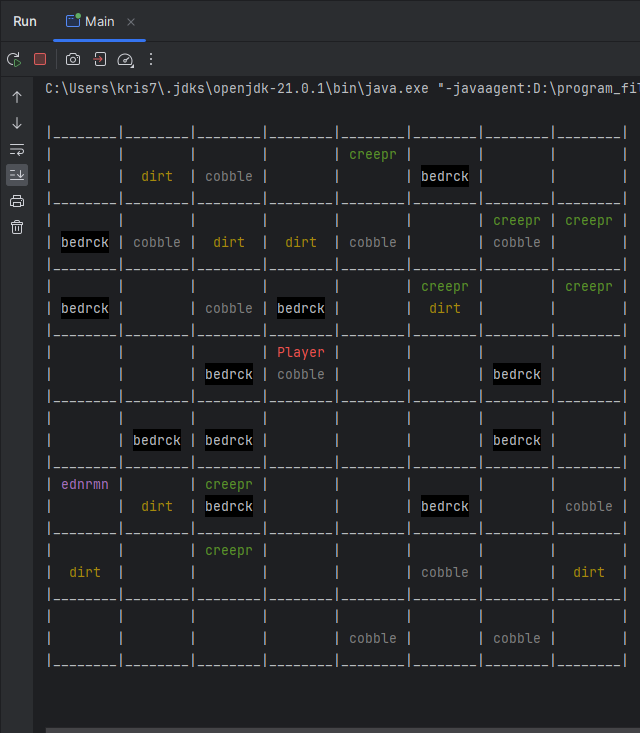
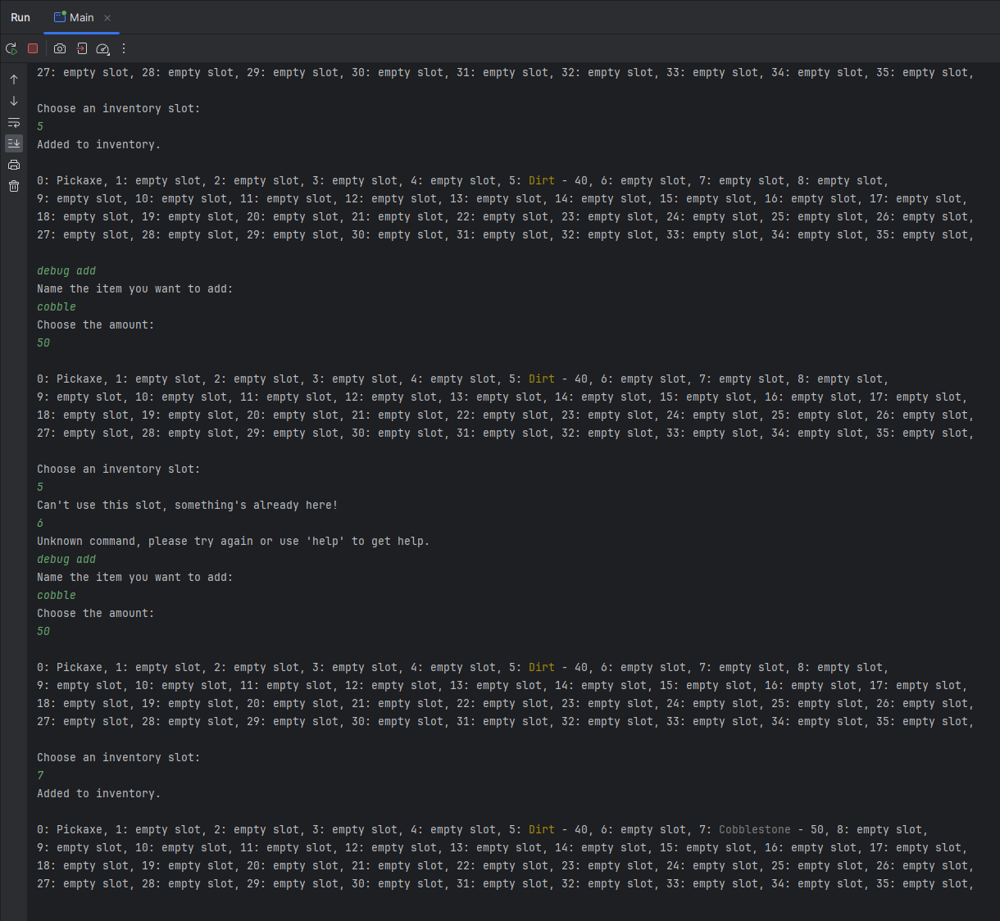
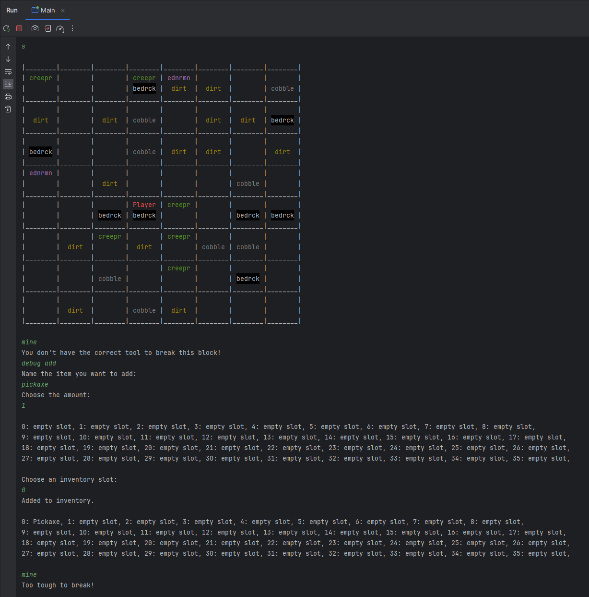

# MINECRAFT-INSPIRED 2D CONSOLE-BASED "GAME" 

## Overview
The goal of this project was to grasp the basics of Java classes, inheritance, interfaces and polymorphism by creating a simple console-based game inspired by Minecraft. The Player can interact with the game by typing various commands in the console, such us move around the map or pick up items.  

## Table of Contents
- [Detailed Description](#detailed-description)
- [Project Structure](#project-structure)
- [Features](#features)
- [Preview of The Application](#preview-of-the-application)
- [Technologies Used](#technologies-used)
- [Future Work](#future-work)
  
## Detailed Description
The game can be played by interacting with the console - typing out commands will correspond to certain actions being undertaken. The game map is an 8x8 grid where blocks can be placed and mobs can stand. The Player starts in the center of the map and can move, craft a select number of items, collect blocks that are on the map or place blocks that they have in their inventory. After actions that involve the Player moving, an updated map is drawn on the console. Similarly, actions related to the Inventory will display it as well. The Player can also encounter and battle mobs that stand on adjacent blocks. The game ends when the Player's health reaches 0.

The stages of the project were:
- creating a grid map that can hold the Player, blocks and mobs
- creating different types of blocks and mobs that are children of the classes ```Thing``` and ```Block```
- implementing interfaces like ```Stackable``` and ```Upgradable``` for certain items/block to have certain functionality/properties
- creating methods that allow the Player character to move, collect and block blocks, deal/receive damage 

## Project Structure
```project1/src/com``` contains all classes of the project. Inside it, the classes are categorised into 5 subdirectories: BlockTypes, Engine, EntityTypes, Interfaces, Tools. The directories ```project1/src/com/BlockTypes```, ```project1/src/com/EntityTypes``` and ```project1/src/com/Tools``` contain classes of objects that appear in-game. The ```project1/src/com/Engine``` directory holds all classes responsible for running the game, displaying the map, all classes and methods connected to the Player and the Main class. Finally, ```project1/src/com/Interfaces``` is somewhat self-explanatory and contains all interfaces created for the purposes of the game.

## Features
- a console-based map the Player can move around on
- collecting and placing blocks
- displaying and adding things to the Inventory
- creating and tools used for mining/digging blocks

### Preview of The Application
This is what the map looks like. Blocks and Entities are generated pseudo-randomly at the start of the game.
\


Inventory behaviour, adding items.
\


This is what happens when you try to mine bedrock.
\

## Technologies Used
The project does not rely on any external libraries, but uses inheritance, interfaces and polimorphism to adhere to the ideas of OOP.

## Future Work
The project is incomplete and requires further work. Fighting (dealing and receiving damage) is yet to be implemented. There are many commands that a Player would want to use that do not exist yet, including the 'help' command. Additionally, a class responsible for displaying the console in a separate window could be added to avoid having to run the game inside an IDE, which is a big limitation on usability at the moment.
